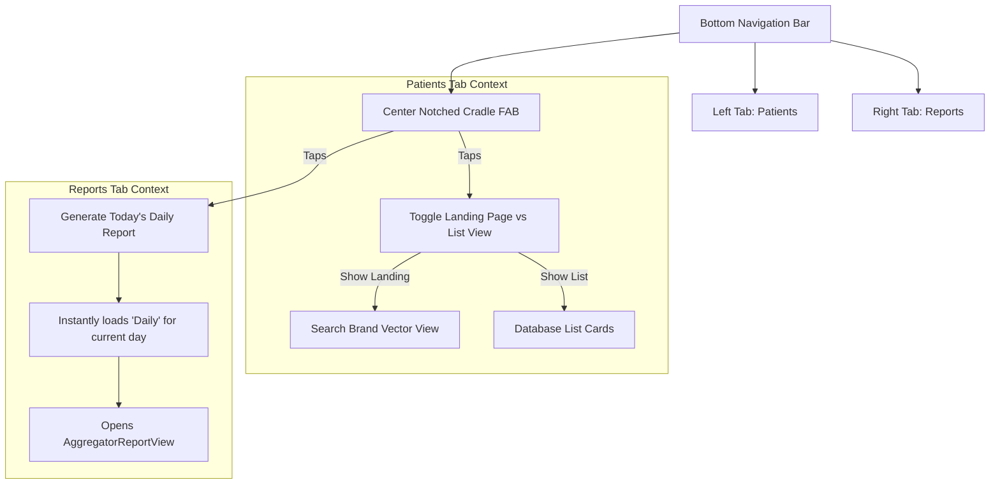

# Technical Implementation Plan: UI Optimizations & Notched Bottom Cradle FAB

This planning document outlines the precise specifications for optimizing the search flow, state preservation, and bottom navigation bar in the database screens ([collection_view.dart](file:///home/ruggedcoder/softwares/fresh/anydb_flutter/lib/screens/collection_view.dart)).

All proposed changes are designed to ensure compile-time safety and visual elegance while keeping code changes **on hold** until explicitly approved.

---

## 🎨 Architectural Design: BHIM UPI Notched bottom cradle FAB
The navigation bar is redesigned to use a premium, modern notched bottom bar. A central **Hero Action Button (Floating Action Button)** sits docked in the notch, serving distinct context-aware roles.



---

## 📂 Core Changes & Detailed Specifications

### 1. AppBar Header Action Refinement
* **Issue:** Redundant Search button appears in the AppBar even on the Reports tab and the database search landing screen.
* **Fix:** Constrain the visibility of the AppBar search button to ONLY when the active tab is a database type AND the database is NOT on its landing search page.
* **Code Spec:**
```dart
// Modify AppBar actions around line 552:
if (currentContent.type == ContentType.database && !isDatabaseLanding)
  IconButton(
    icon: const Icon(Icons.search, size: 26, color: Colors.brown),
    onPressed: () => setState(() => _isSearching = true),
    constraints: const BoxConstraints(),
    padding: const EdgeInsets.symmetric(horizontal: 8),
  ),
```

---

### 2. IME-safe Search Input GlobalKey
* **Issue:** Typing the first character in the landing search bar triggers a widget tree rebuild, causing focus to drop and detaching the virtual keyboard.
* **Fix:** Move `_landingSearchKey` from the `TextField` to the **outer `searchBar` Container**. Moving the entire container together in the subtree prevents the IME connection from being severed.
* **Code Spec:**
```dart
// Modify _buildSearchLandingPage around line 898:
Widget searchBar = Container(
  key: _landingSearchKey, // <-- Key assigned to outer container
  constraints: BoxConstraints(maxWidth: showResults ? double.infinity : 580.0),
  ...
);

// Remove the key from the inner TextField around line 920:
Expanded(
  child: TextField(
    controller: _landingSearchController,
    focusNode: _landingFocusNode,
    autofocus: false,
    ...
  ),
),
```

---

### 3. Clear Search Cache on Switching to List View
* **Issue:** Transitioning back to list view from search results leaves the screen trying to render stale search results.
* **Fix:** Clear `_searchResults` cache and clear `_landingSearchController` when triggering the list view transition.
* **Code Spec:**
```dart
// Modify _executeSearch inside _DatabaseViewState around line 849:
void _executeSearch(String query, {bool transitionToList = false}) {
  if (transitionToList) {
    setState(() {
      _showLandingPage = false;
      _currentFilter = 'Active';
      _searchResults = null; // Clear stale search cache to load master records!
      _landingSearchController.clear(); // Clear search bar input text!
      _initialized = false;
    });
    widget.onLandingPageChanged?.call();
    _init(forced: true);
    if (widget.onSearchSubmitted != null) {
      widget.onSearchSubmitted!(query);
    }
  } else {
    setState(() {
      _landingSearchController.text = query;
    });
  }
}
```

---

### 4. Patient Tab Keep-Alive State
* **Issue:** Tab switches dispose of the Patients tab state, resetting the user to the landing page and losing search/draft context.
* **Fix:** Add `AutomaticKeepAliveClientMixin` to `_DatabaseViewState` and return `wantKeepAlive => true` to cache list state.
* **Code Spec:**
```dart
class _DatabaseViewState extends ConsumerState<_DatabaseView> with AutomaticKeepAliveClientMixin<_DatabaseView> {
  @override
  bool get wantKeepAlive => true;

  @override
  Widget build(BuildContext context) {
    super.build(context); // Crucial for keep-alive validation
    ...
  }
}
```

---

### 5. Premium Bottom Notched Cradle FAB Navigation
* **Issue:** Bottom tab navigation is flat and lacks professional wow-factor; also, navigation is missing a quick-action center-piece.
* **Fix:**
  1. Replace `TabBar` container with a beautifully notched `BottomAppBar`.
  2. Implement a centered docked `FloatingActionButton` that changes roles based on active tab:
     * **Patients Tab (Index 0):** Centered FAB toggles between Search Landing Page and List View (replacing the top-right mini-FABs, which can be safely hidden/removed).
     * **Reports Tab (Index 1):** Centered FAB instantly generates today's daily report.
  3. Create `toggleLandingPage()` inside `_DatabaseViewState` to allow outer Scaffold access.

* **Code Spec for `_DatabaseViewState.toggleLandingPage`:**
```dart
void toggleLandingPage() {
  setState(() {
    _showLandingPage = !_showLandingPage;
    if (!_showLandingPage) {
      _initialized = false;
    }
  });
  widget.onLandingPageChanged?.call();
  _init(forced: true);
}
```

* **Code Spec for `CollectionView.build` Floating Action Button:**
```dart
floatingActionButtonLocation: FloatingActionButtonLocation.centerDocked,
floatingActionButton: FloatingActionButton(
  backgroundColor: const Color(0xFF6B1524),
  foregroundColor: Colors.white,
  elevation: 6,
  shape: const CircleBorder(side: BorderSide(color: Color(0xFFE5C158), width: 1.5)),
  onPressed: () {
    if (_currentTabIndex == 0) {
      // Patients Tab: Toggle search landing page vs. list view
      final dbState = _dbKeys[0].currentState;
      if (dbState != null) {
        dbState.toggleLandingPage();
      }
    } else {
      // Reports Tab: Instantly generate Daily report for Today!
      _generateDailyReportForToday();
    }
  },
  child: Icon(
    _currentTabIndex == 0 
      ? (isDatabaseLanding ? Icons.list : Icons.home) 
      : Icons.today, 
    size: 28,
  ),
),
```

* **Code Spec for `_generateDailyReportForToday`:**
```dart
void _generateDailyReportForToday() {
  AppContent? reportsContent;
  for (var content in widget.contents) {
    if (content.type == ContentType.aggregator) {
      reportsContent = content;
      break;
    }
  }
  if (reportsContent == null || reportsContent.service is! AggregatorService) return;
  
  final agg = reportsContent.service as AggregatorService;
  
  // Look for the report matching the keyword "daily" case-insensitively
  final dailyReport = agg.reports.firstWhere(
    (r) => r.key.toLowerCase().contains("daily"),
    orElse: () => agg.reports.first,
  );
  
  Navigator.push(
    context,
    MaterialPageRoute(
      builder: (context) => AggregatorReportView(
        report: dailyReport,
        agg: agg,
        selectedDate: DateTime.now(), // Current day
        schemaTitle: widget.title,
      ),
    ),
  );
}
```

* **Code Spec for `BottomAppBar` Navigation:**
```dart
bottomNavigationBar: BottomAppBar(
  shape: const CircularNotchedRectangle(),
  notchMargin: 8.0,
  color: Colors.white,
  elevation: 8,
  child: SafeArea(
    child: Row(
      children: [
        // Left Tab: Patients
        Expanded(
          child: InkWell(
            onTap: () {
              if (_currentTabIndex != 0) {
                _tabController.animateTo(0);
              }
            },
            child: Column(
              mainAxisSize: MainAxisSize.min,
              mainAxisAlignment: MainAxisAlignment.center,
              children: [
                Icon(
                  Icons.storage,
                  color: _currentTabIndex == 0 ? const Color(0xFFE9967A) : Colors.grey,
                  size: 24,
                ),
                const SizedBox(height: 4),
                Text(
                  widget.contents[0].name,
                  style: TextStyle(
                    fontSize: 12,
                    fontWeight: FontWeight.bold,
                    color: _currentTabIndex == 0 ? const Color(0xFFE9967A) : Colors.grey,
                  ),
                ),
              ],
            ),
          ),
        ),
        
        // Centered cradle space placeholder (to accommodate the center-docked FAB)
        const SizedBox(width: 64),
        
        // Right Tab: Reports
        Expanded(
          child: InkWell(
            onTap: () {
              if (_currentTabIndex != 1) {
                _tabController.animateTo(1);
              }
            },
            child: Column(
              mainAxisSize: MainAxisSize.min,
              mainAxisAlignment: MainAxisAlignment.center,
              children: [
                Icon(
                  Icons.assessment,
                  color: _currentTabIndex == 1 ? const Color(0xFFE9967A) : Colors.grey,
                  size: 24,
                ),
                const SizedBox(height: 4),
                Text(
                  widget.contents[1].name,
                  style: TextStyle(
                    fontSize: 12,
                    fontWeight: FontWeight.bold,
                    color: _currentTabIndex == 1 ? const Color(0xFFE9967A) : Colors.grey,
                  ),
                ),
              ],
            ),
          ),
        ),
      ],
    ),
  ),
),
```

---

## 🔬 Compilation, Safety & UX Checklist

1. **Autofocus Protection:** Verify that input text fields on the Landing search screen preserve `autofocus: false` to ensure no accidental keyboard popups when switching tabs.
2. **Keyboard Squeezing Prevention:** Verify that `resizeToAvoidBottomInset: false` is configured on the Scaffold so bottom widgets sit smoothly covered when the keyboard is displayed.
3. **No Compilation Errors:** Execute `flutter analyze` immediately after apply approval to guarantee clean compiles.
4. **Visual Aesthetics:** Verify that the FAB's Velvet Crimson background (`#6B1524`) and Gold border (`#E5C158`) blend seamlessly with the bottom navigation layout.
