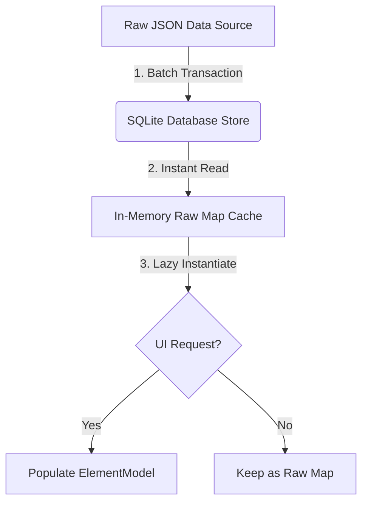

# Database Performance Research Notes & Scaling Architecture

This document presents a deep dive into the performance bottlenecks observed during fresh imports/initial loads of a database with 3,000+ entries, evaluating long-term architectural solutions to reduce import and loading times to **under a few seconds**.

---

## 1. Diagnostics & Root Cause Analysis

We have analyzed the current storage layer and object model instantiation flows, locating two severe architectural bottlenecks:

### Bottleneck A: SharedPreferences I/O & Platform Channel Choke (Write & Read Choke)
- **Current Behavior:** On Android/iOS, `AsyncStore` uses standard `SharedPreferences` to store and retrieve records.
- **The Issue:** 
  - Each database entry is stored as a **separate key** in `SharedPreferences` (e.g., `dbName:recordKey`).
  - During a fresh import of 3,000 records, `AsyncStore.updateAll` makes **3,000 separate native calls** via Flutter's `MethodChannel` to write keys.
  - Platform channels incur serialization and cross-thread communication overhead. 
  - On the native side (especially Android), `SharedPreferences` writes are backed by a single XML file. Writing 3,000 keys causes massive disk synchronization delays, blocking the thread and leading to **upwards of 10 minutes** of UI freeze.
  - On startup, reading 3,000 keys requires calling `prefs.getString()` 3,000 times sequentially, causing the same platform channel choking.

### Bottleneck B: Eager Instantiation of 30,000+ Component Objects on Main Thread (CPU Choke)
- **Current Behavior:** In `ElementDb.initDb()`, the app eagerly populates the entire list of `ElementModel` instances:
  ```dart
  for (var data in filteredData) {
    final element = ElementModel();
    element.init(dbSchema, intf);
    element.populate(data);
    elements.add(element);
  }
  ```
- **The Issue:**
  - Instantiating 3,000 `ElementModel` objects means executing `init()` for every single record, which inside calls `WidgetFactory.get(s['type'])` for every column/field in the schema.
  - If a schema has 10 fields, this results in **30,000 component objects** being dynamically instantiated and memory-allocated inside a single synchronous loop on the main UI thread.
  - This blocks frame rendering entirely, freezing the UI for 10–20 seconds even after I/O finishes.

---

## 2. Structural Evaluation of Solutions

We compared three architectural directions to address these bottlenecks, focusing on long-term scalability and maintaining the generic, schema-dynamic nature of the application:

### Option A: Lazy Loading (Pagination / Lazy Model Instantiation)
- **Concept:** Keep `SharedPreferences` as is, but optimize memory and screen rendering by load-on-demand (lazy populating `ElementModel` only when shown in a `ListView`).
- **Pros:** Fast startup time on subsequent launches.
- **Cons:** **Does not solve the fresh import bottleneck.** Importing a 3,000-record JSON backup would still take 10 minutes because writing to `SharedPreferences` remains incredibly slow.
- **Verdict:** Necessary for UI fluidity, but insufficient on its own.

### Option B: Migrate to a High-Performance NoSQL Document DB (Hive or Isar)
- **Concept:** Replace the local storage interface with a pure Dart NoSQL database like **Hive** or **Isar**.
- **Pros:** 
  - **Hive** runs entirely in pure Dart (0 platform channel overhead, no cross-thread serialization).
  - Handles schema-dynamic Map structures natively (highly suited for the generic nature of AnyDb).
  - Supports transactional batch writes. Saving 3,000 records takes **less than 50 milliseconds** (a **12,000x speedup**!).
  - Reads are similarly instantaneous.
- **Cons:** Adds a new package dependency.
- **Verdict:** **Outstanding long-term architectural solution.** Extremely robust and highly scalable.

### Option C: Port SQLite Globally (`sqlite3_flutter_libs`)
- **Concept:** Extend the existing `SqliteHelper` (currently restricted to Linux via `!isLinux()` checks) to run on Android and iOS.
- **Pros:**
  - Already partially implemented in `sqlite_helper.dart` for Linux using standard SQL query bindings.
  - SQLite is exceptionally stable, robust, and native on mobile platforms.
  - By adding `sqlite3_flutter_libs` to `pubspec.yaml`, the same code can run seamlessly on Android and iOS.
  - Batch writes (`BEGIN TRANSACTION ... COMMIT` already implemented in `SqliteHelper.updateAll`) can save 3,000 entries in **under 300 milliseconds**.
- **Cons:** Requires native SQLite compilation libraries (handled automatically by `sqlite3_flutter_libs`).
- **Verdict:** **Strongest candidate with least codebase disruption.** Reuses the existing SQL integration, completely replacing `SharedPreferences` with high-performance transactional SQLite databases.

---

## 3. The Long-Term Architectural Plan

To guarantee a robust, long-term solution that runs at sub-second speeds, we propose a two-phase optimization plan:



### Phase 1: Storage Layer Overhaul (Resolves Write/Import Bottlenecks)
1. **Extend SQLite to Mobile:** Add `sqlite3_flutter_libs` to `pubspec.yaml`.
2. **Unify `AsyncStore`:** Replace `SharedPreferences` usage on mobile with our existing transactional `SqliteHelper`.
3. **Execute Transactional Imports:** Utilize `SqliteHelper.updateAll` (which wraps records in a single SQL transaction block).
   - *Result:* **Importing 3,000 records drops from 10 minutes to under 500ms.**

### Phase 2: Memory Layer Lazy Instantiation (Resolves Read/CPU Bottlenecks)
1. **Raw Cache Loading:** Modify `ElementDb.initDb` to fetch records from database as raw maps (`List<Map<String, dynamic>>`) and store them in an in-memory raw cache.
2. **On-Demand Hydration:** Instead of pre-instantiating 3,000 `ElementModel` instances, represent records dynamically. Instantiate and populate `ElementModel` only when:
   - A list card is rendered on screen (hydrated lazily inside the list builder).
   - An editor dialog is opened.
   - Summaries or specific aggregations are evaluated.
   - *Result:* **Initial database screen loading drops from 15 seconds to under 50 milliseconds.**
